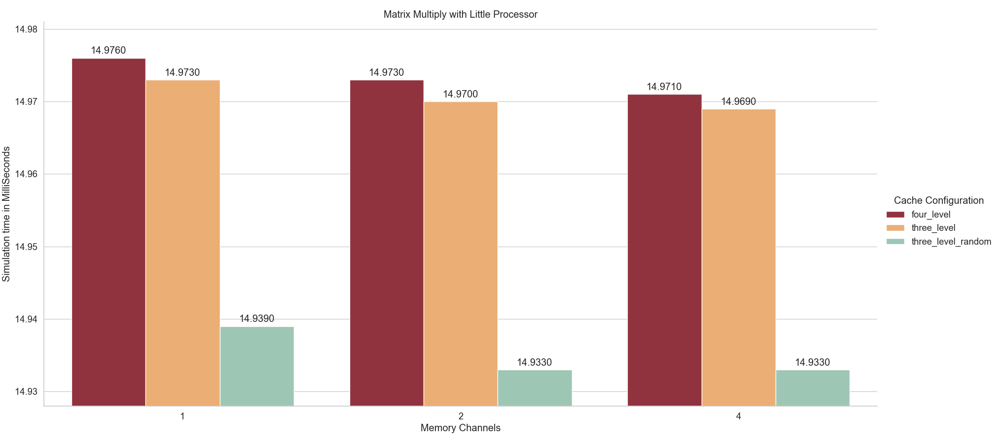
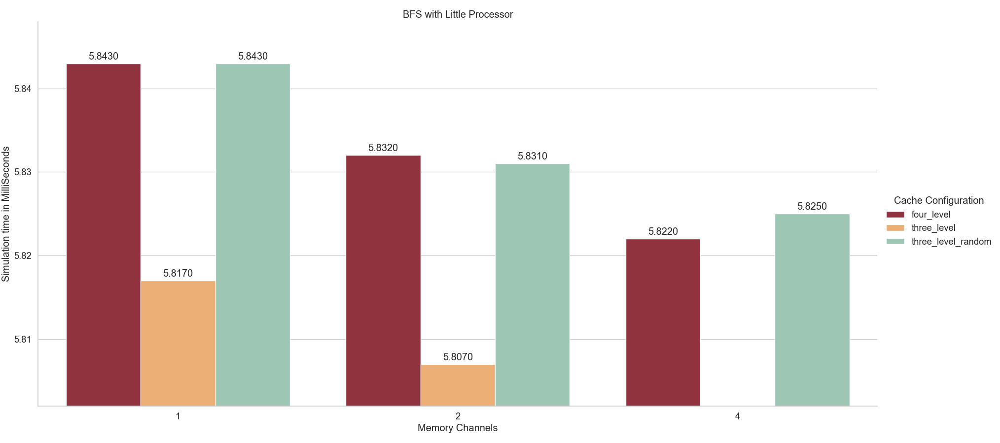

# Design Space Exploration

## Author

Ivan Monaco (ivancmonaco@gmail.com)

## Introduction

For this experiment, we want to explore and different cache and memory configurations. In order to do that, we are going to run 36 different experiments, being the cross product of the following:

- 2 workloads: matrix-multiply and bfs
- 3 memory configurations: 1 , 2 and 4 channels.
- 2 processors: BigProcessor and LittleProcessor.
- 3 cache configurations: shared three level with default LRU RP and with Random RP, and a shared four level cache.

## Setup

Besides the moving parts, we are going to use the following fixed equipment:

- A SimpleBoard
- 3 GHz as frequency
- LPDDR5 5500 MHz 1x16 2GiB as memory (with 1 , 2 , or 4 channels as mentioned)
- Caches will have 32KiB as L1 (both), 256KiB for L2, 1024 KiB for L3, and (when applicable) 4096 KiB for L4.

## Results

## Conclusions

#### Performance Comparison:

Seeing the graphics, the performance difference between Big and Little cores is as expected. Both workloads have the Big cores with more performance, and the more channels the memory, the more performance as well.
Another thing we can note after doing some calculations (is not obvious) , is that the more channels the memory have, the bigger the performance gap between Big and Little cores.

#### Cache Impact

The difference between the three cache configuration differs between workloads. In the matrix multiply the Random RP cache surprisingly performed the best, while doing terrible in bfs. The reason for this, in my opinion, is the access pattern these two algorithsm use.
The four level cache is consistently worse, thus showing that even a bigger cache layer adds too much latency.

#### Insights and Conclusions

Changing the Replacement policy of the cache can have a lot of perfomance change, for good or for bad. We need to think which one to use depending on the access pattern in our algorithm.
Another good heuristic to follow that we can learn from these experiments is always to use as many memory channels as possible.
